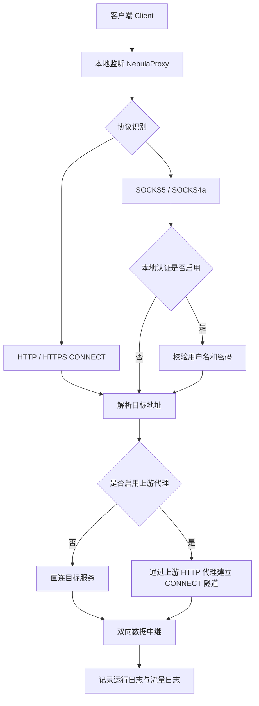
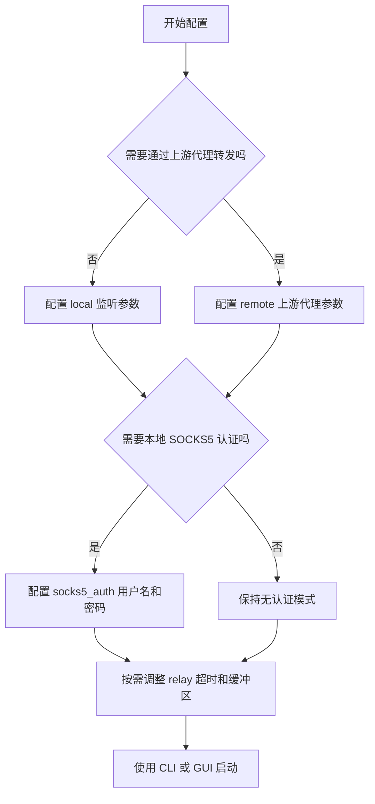

# NebulaProxy

> 一个基于 Python 的多协议本地代理工具，支持 SOCKS5、SOCKS4/4a、HTTP、HTTPS CONNECT，并提供可选的 PySide6 桌面管理界面。


一个本地统一代理入口，适用于上游代理验证、轻量级流量转发、桌面化配置管理与本地代理测试。

## 🌌 项目概览

NebulaProxy 的核心目标，是在本地提供一个统一代理入口，接收多种客户端代理请求，再根据配置决定：

- 直接连接目标主机
- 通过上游 HTTP 代理转发

项目当前由两个主要组件构成：

- `proxy.py`：核心代理服务，负责协议识别、认证处理、连接建立、双向转发和日志记录
- `NebulaGate.py`：桌面管理端，负责配置读写、上游验证、服务启停和日志展示

该项目适合用于本地代理测试、上游代理可用性验证、轻量级流量转发以及桌面化代理管理场景。

## ✨ 主要功能

### 🌐 代理协议支持

- SOCKS5
- SOCKS4 / SOCKS4a
- HTTP
- HTTPS CONNECT

### 🔀 出站模式支持

- 直连目标地址
- 通过上游 HTTP 代理转发

### 🔐 认证与控制能力

- 支持本地 SOCKS5 用户名/密码认证
- 支持上游代理 Basic 认证
- 支持最大并发连接数限制
- 支持中继超时与缓冲区大小配置

### 📝 可观测性与运维能力

- 启动日志与错误日志
- 独立流量日志
- 日志按天滚动
- 桌面界面实时查看运行日志
- 快速打开日志目录

## ⚡ 快速开始

1. 参考 `proxy.example.conf` 配置本地 `proxy.conf`
2. 选择启动方式：
   - `python proxy.py`
   - `python NebulaGate.py`
3. 将客户端代理指向本地监听地址
4. 检查 `logs/proxy.log` 与 `logs/traffic.log`

## 🧭 工作流程图

### 代理流量路径图



### GUI 操作流程图


### 配置决策图



## 🧰 环境要求

- Python 3.10 或更高版本
- Windows 环境下 GUI 体验更完整
- 使用 GUI 时需要安装 `PySide6`

## 📦 安装方式

### 仅使用命令行代理

如果只运行代理服务核心：

```bash
python -m pip install --upgrade pip
```

当前仓库中，代理核心本身不依赖额外第三方包。

### 使用桌面管理界面

安装 GUI 依赖：

```bash
python -m pip install -r requirements.txt
```

或单独安装：

```bash
python -m pip install PySide6
```

## 🚀 使用方式

### 启动命令行代理服务

```bash
python proxy.py
```

启动后程序会：

- 加载配置文件
- 在启用上游模式时验证上游连通性
- 绑定本地监听端口
- 自动创建 `logs/` 目录
- 写入运行日志和流量日志

### 启动桌面管理界面

```bash
python NebulaGate.py
```

GUI 可执行的操作包括：

- 加载配置
- 保存配置
- 验证上游代理
- 启动代理
- 停止代理
- 查看运行日志
- 打开日志目录

## ⚙️ 配置说明

默认配置文件为 `proxy.conf`。建议先参考 `proxy.example.conf` 创建或修改本地配置，不要直接在文档中保存真实账号密码。

### `[remote]` 上游代理配置

```ini
[remote]
enabled = false
host = 127.0.0.1
port = 3128
username = your_upstream_user
password = your_upstream_password
```

字段说明：

- `enabled`：是否启用上游代理模式
- `host`：上游 HTTP 代理地址
- `port`：上游 HTTP 代理端口
- `username`：上游代理用户名
- `password`：上游代理密码

### `[local]` 本地监听配置

```ini
[local]
host = 127.0.0.1
port = 7463
max_connections = 200
```

字段说明：

- `host`：本地监听地址
- `port`：本地监听端口
- `max_connections`：最大并发连接数

### `[socks5_auth]` 本地 SOCKS5 认证

```ini
[socks5_auth]
enabled = false
username = local_user
password = local_pass
```

字段说明：

- `enabled`：是否启用 SOCKS5 用户名/密码认证
- `username`：本地 SOCKS5 用户名
- `password`：本地 SOCKS5 密码

### `[relay]` 中继参数

```ini
[relay]
timeout = 60
buffer_size = 4096
```

字段说明：

- `timeout`：中继超时时间，单位秒
- `buffer_size`：单次转发缓冲区大小，单位字节

## 🎯 典型使用场景

### 本地统一代理入口

将浏览器、脚本或桌面应用统一指向本地监听地址，例如：

- `127.0.0.1:7463`

由 NebulaProxy 负责将请求直连目标服务，或转发到指定上游代理。

### 上游 HTTP 代理验证

在接入上游代理前，可通过 GUI 先进行连通性验证，确认代理地址、端口和认证信息是否可用。

### 本地 SOCKS5 访问控制

启用本地 SOCKS5 认证后，客户端必须先通过用户名/密码校验，才能建立代理连接。

## 📝 日志说明

程序运行后会自动创建 `logs/` 目录，并生成以下日志文件：

- `logs/proxy.log`：记录启动、运行状态与错误信息
- `logs/traffic.log`：记录每条连接的流量统计数据
- `logs/nebulagate_debug.log`：GUI 调试日志

流量日志中包含的信息包括：

- 时间
- 客户端地址
- 协议类型
- 目标地址
- 目标端口
- 状态
- 上行字节数
- 下行字节数
- 耗时（毫秒）

## ⚠️ 注意事项与限制

- GUI 对 `os.startfile` 的使用使其更偏向 Windows 环境
- 当前上游验证依赖预设测试目标，在受限网络环境下可能误判
- 未看到完整打包、发布或自动化测试配置
- 配置文件使用明文存储账号密码，部署时需要自行做好保护

## 🔒 安全注意事项

- 不要将真实 `proxy.conf` 提交到版本控制系统
- 不要在 README、截图或日志中泄露上游代理凭据
- 建议使用 `proxy.example.conf` 作为模板初始化新环境
- 如果运行环境中包含真实口令，应限制配置文件访问权限

## 📁 项目结构

```text
.
├── proxy.py           # 核心多协议代理服务
├── NebulaGate.py      # PySide6 桌面管理界面
├── proxy.conf         # 本地运行配置文件（敏感）
├── proxy.example.conf # 脱敏示例配置
├── requirements.txt   # GUI 依赖
├── CHANGELOG.md       # 变更记录
├── LICENSE            # MIT 许可证
├── README_EN.md       # 英文文档
└── logs/              # 运行时自动创建的日志目录
```

## 📌 项目元信息

- 依赖文件：`requirements.txt`
- 示例配置：`proxy.example.conf`
- 英文文档：`README_EN.md`
- 许可证：`LICENSE`（MIT）

## English Documentation

See [README_EN.md](README_EN.md) for the English version.
