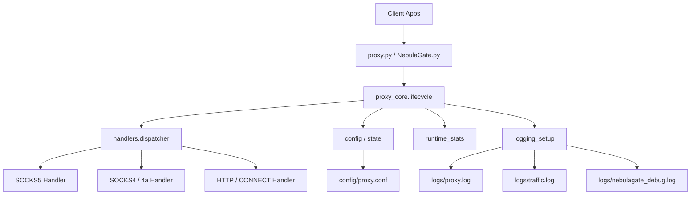
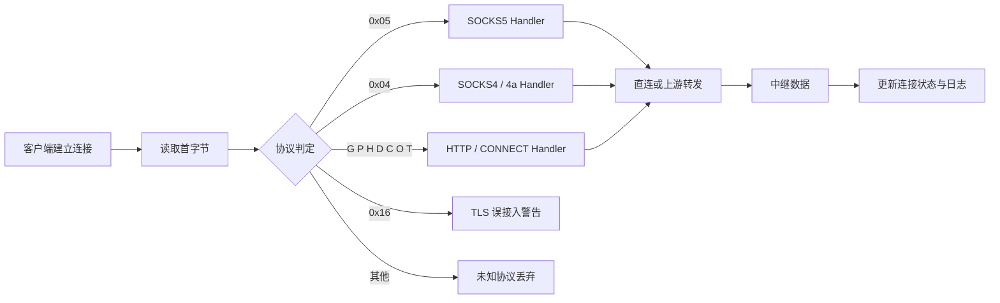
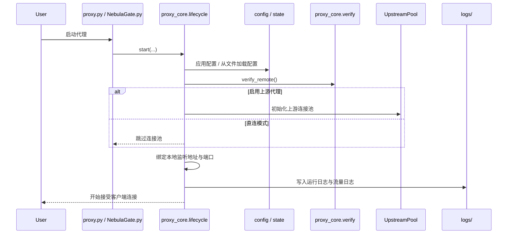
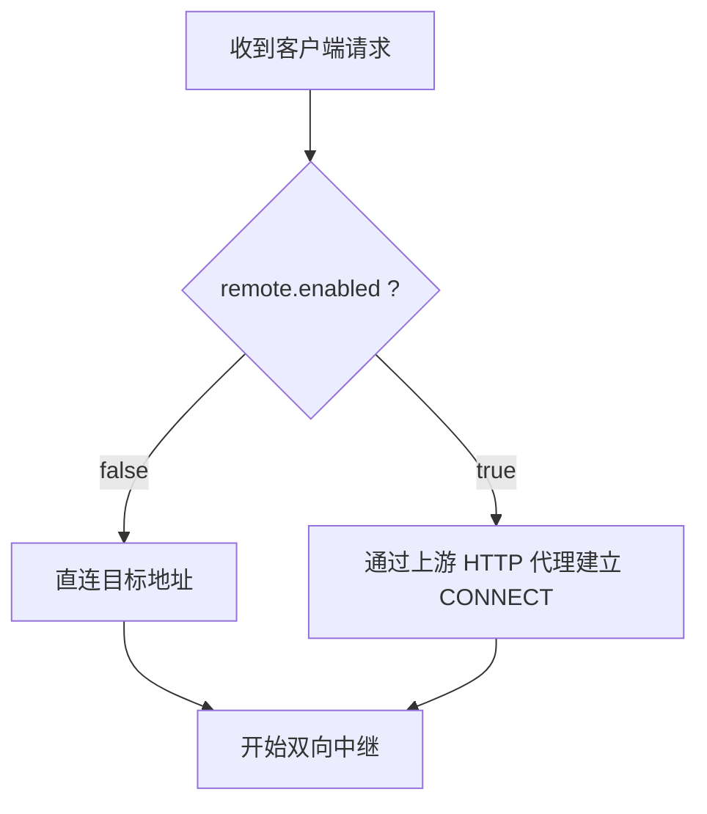

# NebulaProxy

> 一个本地多协议代理入口，支持 SOCKS5、SOCKS4/4a、HTTP、HTTPS CONNECT，并提供可选的 PySide6 图形管理界面。


> 适合把本机应用统一接入到一个可控、可观测、可切换上游的代理入口：既能直连目标，也能经上游 HTTP 代理中转，还能通过 GUI 完成配置、验证、启停与日志查看。

## 导航

- [核心亮点](#核心亮点)
- [功能矩阵](#功能矩阵)
- [架构总览](#架构总览)
- [流量处理流程](#流量处理流程)
- [启动生命周期](#启动生命周期)
- [运行模式](#运行模式)
- [快速开始](#快速开始)
- [配置参考](#配置参考)
- [GUI 能力](#gui-能力)
- [日志与观测](#日志与观测)
- [目录结构](#目录结构)
- [限制与说明](#限制与说明)
- [安全提醒](#安全提醒)
- [更多文档](#更多文档)

## 文档切换

- 中文：`README.md`
- English: `docs/README_EN.md`

## 核心亮点

- **多协议统一入口**：同一个本地服务支持 SOCKS5、SOCKS4/4a、HTTP、HTTPS CONNECT 入站请求
- **两种转发模式**：既支持直连目标地址，也支持经上游 HTTP 代理转发
- **认证能力完整**：支持本地 SOCKS5 用户名/密码认证，也支持上游代理 Basic 认证
- **CLI / GUI 双入口**：既可脚本化运行，也可使用 NebulaGate 图形界面进行管理
- **可观测性更强**：内置运行日志、流量日志、GUI 调试日志与连接状态统计

## 功能矩阵

| 能力 | 说明 |
| --- | --- |
| 入站协议 | SOCKS5 / SOCKS4 / SOCKS4a / HTTP / HTTPS CONNECT |
| 出站模式 | 直连目标地址 / 上游 HTTP 代理转发 |
| 本地认证 | 支持 SOCKS5 用户名密码认证 |
| 上游认证 | 支持 HTTP Basic 认证 |
| 图形界面 | 基于 PySide6 的 NebulaGate 管理界面 |
| 运维能力 | 配置读写、上游验证、代理启停、日志查看、连接状态查看 |
| 日志体系 | `logs/proxy.log` / `logs/traffic.log` / `logs/nebulagate_debug.log` |

## 架构总览

NebulaProxy 的根目录保留两个入口文件，核心逻辑下沉到 `proxy_core/`。CLI 和 GUI 最终都会汇聚到同一套生命周期、配置、协议分发与日志体系。



### 入口说明

- `proxy.py`：CLI 入口，适合直接启动或集成到脚本流程
- `NebulaGate.py`：GUI 入口，适合交互式配置与运维操作
- `proxy_core/`：协议分发、生命周期控制、上游验证、连接池、日志、运行状态等核心实现

## 流量处理流程

程序会先读取客户端连接的首字节，根据协议特征把流量分发到不同处理器。



### 协议识别说明

- `0x05`：进入 SOCKS5 处理流程
- `0x04`：进入 SOCKS4 / SOCKS4a 处理流程
- `G/P/H/D/C/O/T`：按 HTTP 方法首字母识别 HTTP / CONNECT 请求
- `0x16`：通常意味着客户端把当前端口当成了原生 TLS 入口，程序会记录 `TLS_PROXY_MISMATCH` 警告
- 其他未知首字节会被直接丢弃并记录日志

## 启动生命周期

启动过程会按固定顺序完成配置加载、上游验证、资源初始化和本地监听。



## 运行模式

NebulaProxy 支持两种核心出站模式：直连模式和上游代理模式。



- **直连模式**：`[remote].enabled = false`，跳过上游验证与连接池初始化
- **上游模式**：`[remote].enabled = true`，启动时先验证上游代理可达性，再创建上游连接池

## 快速开始

### 1. 准备配置文件

以示例配置为模板，生成本地配置文件：

```bash
cp config/proxy.example.conf config/proxy.conf
```

如果你在 Windows PowerShell 中操作，也可以手动复制该文件。

### 2. 按需修改配置

最常见的调整项包括：

- `[local]` 中的监听地址、端口、最大连接数
- `[remote]` 中是否启用上游代理、上游地址和认证信息
- `[socks5_auth]` 中是否启用本地 SOCKS5 用户名/密码认证
- `[relay]` 中的超时与缓冲区大小

### 3. 安装 GUI 依赖（仅图形界面需要）

```bash
python -m pip install -r requirements.txt
```

### 4. 选择启动方式

#### CLI

```bash
python proxy.py
```

#### GUI

```bash
python NebulaGate.py
```

### 5. 配置客户端

将浏览器、系统代理或其他本地应用指向 `config/proxy.conf` 中的本地监听地址，例如：

- Host：`127.0.0.1`
- Port：`7463`

### 6. 检查运行状态

启动后建议优先查看：

- `logs/proxy.log`
- `logs/traffic.log`
- `logs/nebulagate_debug.log`（如果使用 GUI）

## 配置参考

默认配置文件：`config/proxy.conf`  
示例配置文件：`config/proxy.example.conf`

### 示例配置

> 下方示例使用的是占位符，不包含任何真实敏感信息。

```ini
[remote]
enabled = false
host = 127.0.0.1
port = 3128
username = your_upstream_user
password = your_upstream_password

[local]
host = 127.0.0.1
port = 7463
max_connections = 200

[socks5_auth]
enabled = false
username = local_user
password = local_pass

[relay]
timeout = 60
buffer_size = 4096
```

### 配置段说明

| 配置段 | 作用 | 常见字段 |
| --- | --- | --- |
| `[remote]` | 控制是否启用上游 HTTP 代理，以及上游认证信息 | `enabled` `host` `port` `username` `password` |
| `[local]` | 控制本地监听地址、端口、最大连接数 | `host` `port` `max_connections` |
| `[socks5_auth]` | 控制本地 SOCKS5 用户名密码认证 | `enabled` `username` `password` |
| `[relay]` | 控制数据中继时的超时和缓冲区 | `timeout` `buffer_size` |

### 推荐理解方式

- 如果只想做本地统一代理入口，先把 `[remote].enabled` 设为 `false`
- 如果需要走上游代理，再开启 `[remote].enabled` 并填写上游地址和凭据
- 如果需要限制本地客户端访问，再开启 `[socks5_auth].enabled`
- `buffer_size` 和 `timeout` 主要影响数据中继体验与稳定性

## GUI 能力

NebulaGate 是一个基于 PySide6 的可选图形管理界面，适合在本地调试、验证和日常运维时使用。

### GUI 可以做什么

- 读取并保存代理配置
- 验证上游代理连通性
- 启动 / 停止 NebulaProxy
- 查看运行日志和 GUI 调试日志
- 查看活动连接、状态与吞吐信息

### 适用场景

- 不想手改配置文件时进行可视化配置
- 需要在启动前先验证上游代理是否可用
- 需要边运行边看日志和连接状态

## 日志与观测

运行后会在 `logs/` 下生成日志文件：

| 日志文件 | 用途 |
| --- | --- |
| `logs/proxy.log` | 运行日志、异常日志、启动/停止事件 |
| `logs/traffic.log` | 连接建立、流量中继、协议相关流量记录 |
| `logs/nebulagate_debug.log` | GUI 调试日志 |

### 建议排查顺序

1. 先看 `logs/proxy.log` 是否成功启动监听
2. 再看 `logs/traffic.log` 是否有客户端连接进入
3. 如果使用 GUI，再看 `logs/nebulagate_debug.log` 是否有界面侧错误

## 目录结构

```text
.
├── proxy.py
├── NebulaGate.py
├── proxy_core/
│   ├── handlers/
│   └── ...
├── config/
│   ├── proxy.conf
│   └── proxy.example.conf
├── docs/
│   ├── README_EN.md
│   └── CHANGELOG.md
├── logs/
├── README.md
├── LICENSE
└── requirements.txt
```

## 限制与说明

- GUI 依赖 `PySide6`，仅在使用图形界面时需要安装
- GUI 在 Windows 下体验更完整
- 当启用上游代理时，启动阶段会验证到 `www.baidu.com:80` 的连通性
- 当前仓库更适合以源码方式运行，尚未提供容器化、安装器或打包发布流程

## 安全提醒

- **不要提交真实的 `config/proxy.conf`**
- **不要在截图、日志、Issue、PR 或文档中泄露上游代理地址、用户名、密码**
- 建议始终使用 `config/proxy.example.conf` 作为初始化模板
- 如需共享日志，请先脱敏主机名、端口、认证字段和其他环境信息

## 更多文档

- 英文文档：`docs/README_EN.md`
- 变更记录：`docs/CHANGELOG.md`

## License

MIT
