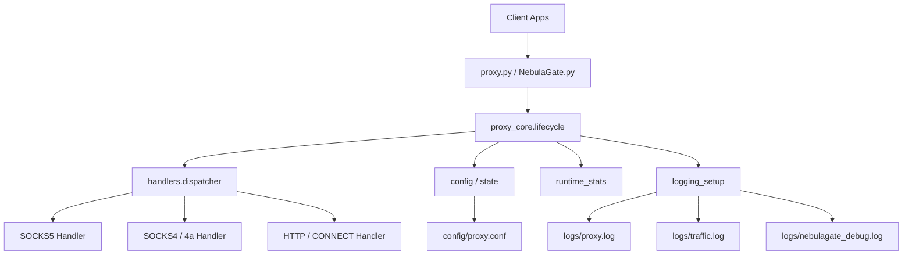
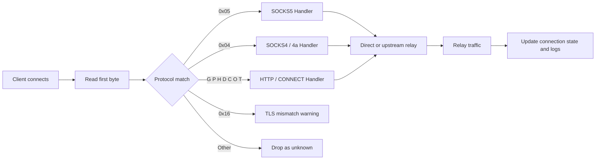
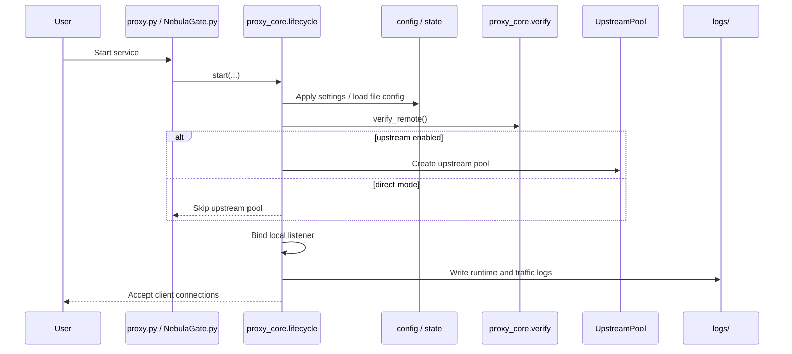
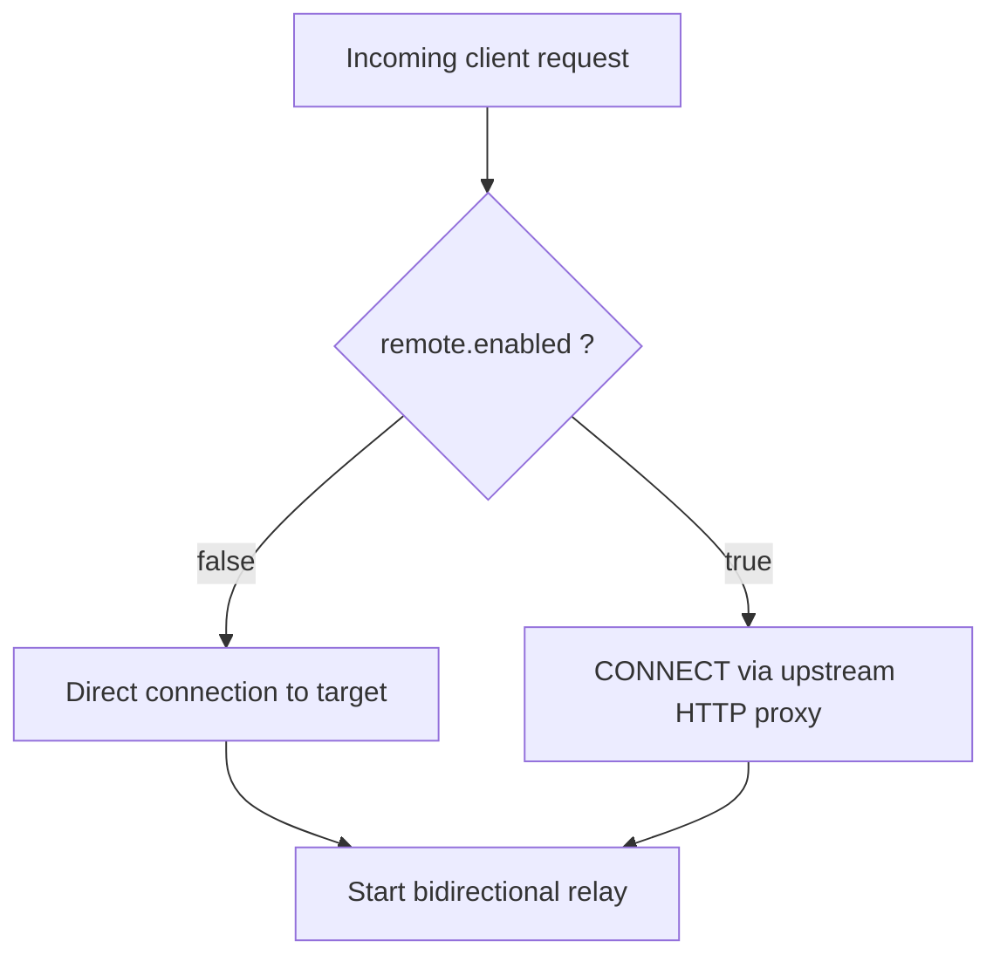

# NebulaProxy

> A local multi-protocol proxy entrypoint with support for SOCKS5, SOCKS4/4a, HTTP, and HTTPS CONNECT, plus an optional PySide6 desktop console.


> Use NebulaProxy when you want one controllable local proxy gateway for desktop apps, browsers, scripts, or testing tools: it can connect directly to targets, relay through an upstream HTTP proxy, and expose GUI-based configuration, validation, startup, shutdown, and log inspection.

## Navigation

- [Highlights](#highlights)
- [Feature Matrix](#feature-matrix)
- [Architecture Overview](#architecture-overview)
- [Traffic Flow](#traffic-flow)
- [Startup Lifecycle](#startup-lifecycle)
- [Operating Modes](#operating-modes)
- [Quick Start](#quick-start)
- [Configuration](#configuration)
- [GUI Capabilities](#gui-capabilities)
- [Logging and Observability](#logging-and-observability)
- [Repository Layout](#repository-layout)
- [Limitations and Notes](#limitations-and-notes)
- [Security Notes](#security-notes)
- [Related Documents](#related-documents)

## Language Switch

- 中文：`../README.md`
- English: `docs/README_EN.md`

## Highlights

- **One local gateway for multiple protocols**: accepts SOCKS5, SOCKS4/4a, HTTP, and HTTPS CONNECT traffic
- **Two outbound modes**: direct destination access or relay through an upstream HTTP proxy
- **Built-in authentication options**: local SOCKS5 username/password auth and upstream proxy Basic auth
- **Dual entrypoints**: run from the CLI or manage it with the NebulaGate desktop GUI
- **Better observability**: runtime logs, traffic logs, GUI debug logs, and active connection tracking

## Feature Matrix

| Capability | Description |
| --- | --- |
| Inbound protocols | SOCKS5 / SOCKS4 / SOCKS4a / HTTP / HTTPS CONNECT |
| Outbound modes | Direct destination access / Upstream HTTP proxy relay |
| Local auth | SOCKS5 username/password authentication |
| Upstream auth | HTTP Basic authentication |
| GUI | PySide6-based NebulaGate desktop console |
| Operations | Config load/save, upstream verification, start/stop, log viewing, connection inspection |
| Logs | `logs/proxy.log` / `logs/traffic.log` / `logs/nebulagate_debug.log` |

## Architecture Overview

The repository keeps two entry files at the root and moves the implementation into `proxy_core/`. Both the CLI and the GUI eventually use the same lifecycle, configuration, protocol dispatch, logging, and runtime-state layers.



### Entry Points

- `proxy.py`: CLI / compatibility entrypoint
- `NebulaGate.py`: GUI / compatibility entrypoint
- `proxy_core/`: lifecycle, config, dispatcher, handlers, upstream verification, connection state, and logging

## Traffic Flow

Connections are classified by their first byte or HTTP method prefix, then dispatched to the matching protocol handler.



### Protocol Classification Notes

- `0x05`: SOCKS5 flow
- `0x04`: SOCKS4 / SOCKS4a flow
- `G/P/H/D/C/O/T`: HTTP method initials used to recognize HTTP / CONNECT requests
- `0x16`: usually indicates a raw TLS ClientHello sent to a proxy port; the proxy records a `TLS_PROXY_MISMATCH` warning
- unknown first bytes are dropped and logged

## Startup Lifecycle

Service startup follows a fixed sequence: configuration, upstream verification, resource initialization, socket binding, then request acceptance.



## Operating Modes

NebulaProxy supports two main outbound modes.



- **Direct mode**: `[remote].enabled = false`, so upstream verification and pool creation are skipped
- **Upstream mode**: `[remote].enabled = true`, so the proxy validates upstream connectivity before creating the upstream pool

## Quick Start

### 1. Prepare the configuration

Create your local runtime config from the example file:

```bash
cp config/proxy.example.conf config/proxy.conf
```

If you are working from Windows PowerShell, you can also copy the file manually.

### 2. Adjust the settings you need

The most common changes are:

- listener address, port, and max connections under `[local]`
- upstream enable flag, host, port, and credentials under `[remote]`
- local SOCKS5 auth under `[socks5_auth]`
- relay timeout and buffer size under `[relay]`

### 3. Install GUI dependencies if needed

```bash
python -m pip install -r requirements.txt
```

### 4. Choose how to run it

#### CLI

```bash
python proxy.py
```

#### GUI

```bash
python NebulaGate.py
```

### 5. Point your client to the local listener

For example:

- Host: `127.0.0.1`
- Port: `7463`

### 6. Check the logs

After startup, inspect:

- `logs/proxy.log`
- `logs/traffic.log`
- `logs/nebulagate_debug.log` (when using the GUI)

## Configuration

Default config file: `config/proxy.conf`  
Example config file: `config/proxy.example.conf`

### Example

> The sample below uses placeholders only and does not contain any live credentials.

```ini
[remote]
enabled = false
host = 127.0.0.1
port = 3128
username = your_upstream_user
password = your_upstream_password

[local]
host = 127.0.0.1
port = 7463
max_connections = 200

[socks5_auth]
enabled = false
username = local_user
password = local_pass

[relay]
timeout = 60
buffer_size = 4096
```

### Section Reference

| Section | Purpose | Common fields |
| --- | --- | --- |
| `[remote]` | Controls upstream HTTP proxy mode and upstream auth | `enabled` `host` `port` `username` `password` |
| `[local]` | Controls local bind address, port, and maximum connections | `host` `port` `max_connections` |
| `[socks5_auth]` | Controls local SOCKS5 username/password auth | `enabled` `username` `password` |
| `[relay]` | Controls relay timeout and buffer sizing | `timeout` `buffer_size` |

### Practical Guidance

- Set `[remote].enabled = false` if you only need a local unified proxy endpoint
- Enable `[remote]` when you want to forward through an upstream HTTP proxy
- Enable `[socks5_auth]` when local clients should authenticate before using the proxy
- Tune `timeout` and `buffer_size` only if your relay behavior needs adjustment

## GUI Capabilities

NebulaGate is an optional PySide6 desktop console for local operation, validation, and day-to-day management.

### What the GUI can do

- load and save configuration
- verify upstream proxy connectivity
- start and stop NebulaProxy
- view runtime logs and GUI debug logs
- inspect active connections, status, and throughput

### When it is useful

- when you do not want to hand-edit config files
- when you want to validate upstream settings before starting traffic relay
- when you want to observe logs and connection state while the proxy is running

## Logging and Observability

The application writes the following files under `logs/`:

| Log file | Purpose |
| --- | --- |
| `logs/proxy.log` | runtime events, startup/shutdown messages, and errors |
| `logs/traffic.log` | connection-level traffic and relay activity |
| `logs/nebulagate_debug.log` | GUI debug output |

### Suggested troubleshooting order

1. Check `logs/proxy.log` to confirm the local listener started successfully
2. Check `logs/traffic.log` to confirm client sessions are reaching the proxy
3. If using the GUI, check `logs/nebulagate_debug.log` for desktop-side issues

## Repository Layout

```text
.
├── proxy.py
├── NebulaGate.py
├── proxy_core/
│   ├── handlers/
│   └── ...
├── config/
│   ├── proxy.conf
│   └── proxy.example.conf
├── docs/
│   ├── README_EN.md
│   └── CHANGELOG.md
├── logs/
├── README.md
├── LICENSE
└── requirements.txt
```

## Limitations and Notes

- the GUI depends on `PySide6` and only needs to be installed when you use the desktop console
- the GUI workflow is more complete on Windows
- when upstream mode is enabled, startup validation currently checks connectivity to `www.baidu.com:80`
- the repository is currently best used from source and does not yet ship with packaging, installer, or container workflows

## Security Notes

- **Do not commit a real `config/proxy.conf`**
- **Do not expose upstream hosts, usernames, passwords, or other live values in screenshots, logs, issues, PRs, or docs**
- use `config/proxy.example.conf` as the safe bootstrap template
- redact hostnames, ports, auth fields, and environment-specific values before sharing logs

## Related Documents

- 中文文档：`../README.md`
- Changelog: `CHANGELOG.md`

## License

MIT
